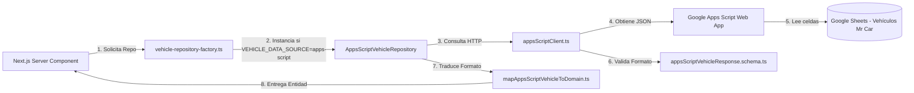

# Arquitectura del Software - Mr. Car

La aplicación Mr. Car está estructurada según los principios de **Clean Architecture** (Arquitectura Limpia) y diseño guiado por el dominio (DDD). Esto garantiza que la lógica de negocio esté completamente desacoplada de la interfaz gráfica y del origen físico de los datos.

## Principios de Diseño

### 1. SOLID
* **S (Single Responsibility)**: Cada clase/componente realiza una única función. Por ejemplo, `AppsScriptVehicleRepository` gestiona la lógica de exclusión de ocultos y duplicados; `mapAppsScriptVehicleToDomain` realiza la traducción de tipos; `appsScriptClient` maneja llamadas HTTP.
* **O (Open/Closed)**: Podemos añadir o intercambiar repositorios (ej. conectar una base de datos PostgreSQL) escribiendo una nueva clase que implemente `VehicleRepository` y registrándola en el Factory, sin tocar los componentes visuales ni los casos de uso.
* **L (Liskov Substitution)**: Las implementaciones `MockVehicleRepository` y `AppsScriptVehicleRepository` heredan de la abstracción `VehicleRepository` de manera consistente y son totalmente sustituibles.
* **I (Interface Segregation)**: Los contratos e interfaces de dominio son pequeños, claros y específicos.
* **D (Dependency Inversion)**: Los controladores de páginas e interfaces gráficas no instancian directamente los repositorios concretos. En su lugar, utilizan el método unificado `createVehicleRepository()` que encapsula la selección en base a variables de entorno.

---

## Estructura de Capas e Integración de Apps Script

```
src/
├── domain/                               # Capa de Dominio (Entidades de negocio y contratos)
│   ├── entities/
│   │   └── vehicle.ts                    # Tipo estricto de la entidad Vehicle
│   └── repositories/
│       └── vehicle-repository.ts         # Contrato formal de VehicleRepository
│
├── application/                          # Capa de Aplicación (Casos de Uso)
│   └── use-cases/                        # GetVehicles, GetFeatured, GetBySlug, Search
│
├── infrastructure/                       # Capa de Infraestructura (Accesos y Validaciones)
│   ├── config/
│   │   └── env.ts                        # Validación Zod de variables de entorno
│   ├── repositories/
│   │   ├── mock-vehicle-repository.ts    # Repo en memoria
│   │   └── vehicle-repository-factory.ts # Factory para resolver el repositorio activo
│   ├── apps-script/                      # Integración directa con Google Sheets
│   │   ├── AppsScriptVehicleRepository.ts # Implementación de repositorio en vivo
│   │   ├── appsScriptClient.ts           # Llamadas HTTP fetch con caché revalidable
│   │   ├── appsScriptVehicleResponse.schema.ts # Esquemas Zod para la API
│   │   ├── mapAppsScriptVehicleToDomain.ts # Mapeador de datos crudos a entidades
│   │   └── errors.ts                     # Definición de errores tipados
│   └── schemas/
│       └── vehicle.schema.ts             # Esquema Zod de la entidad interna
│
└── presentation/                         # Capa de Presentación (UI y Utilidades)
```

---

## Flujo de Datos y Conexión



El enmascaramiento de errores de red protege la seguridad de la infraestructura: fallos de red o de configuración del endpoint son capturados en la capa de infraestructura y convertidos a excepciones genéricas y seguras antes de llegar a la interfaz de usuario.
